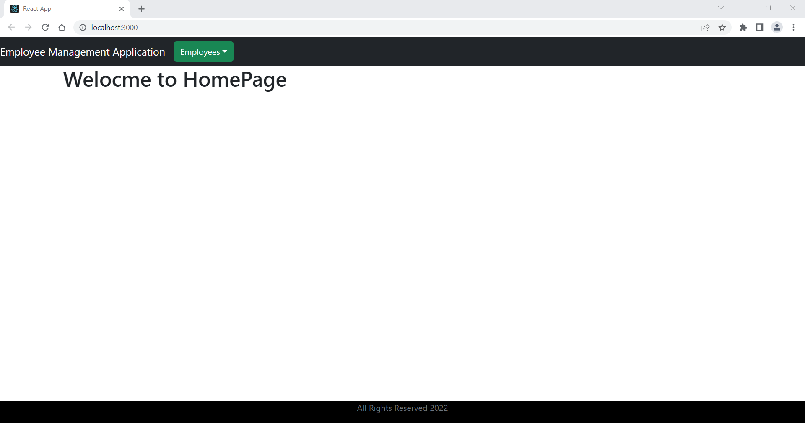
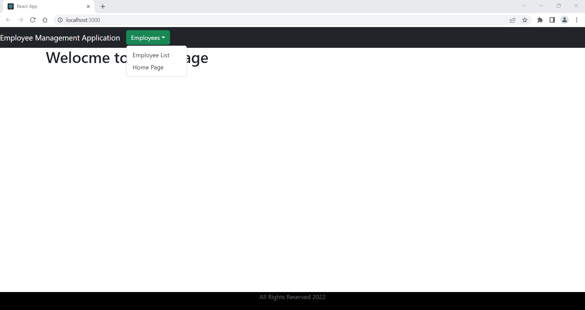
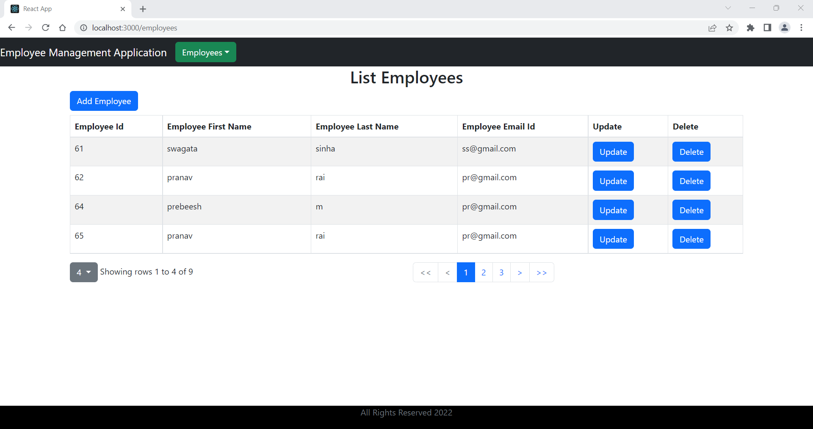
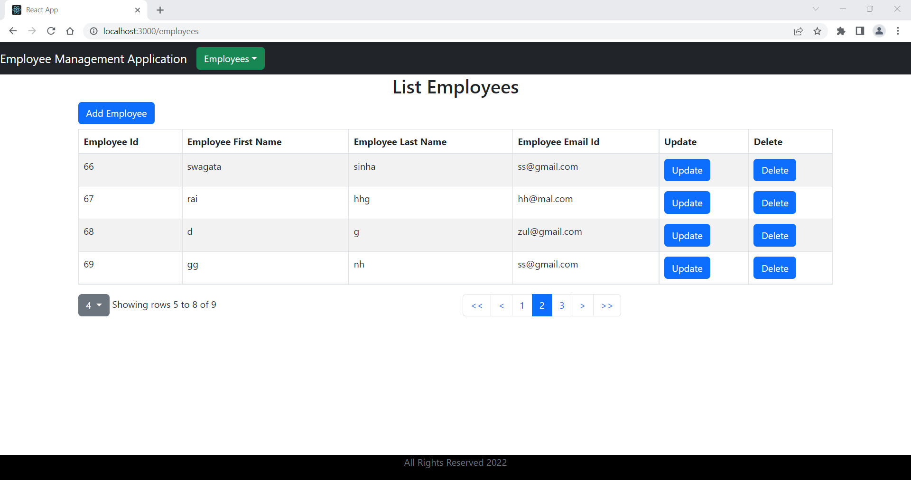
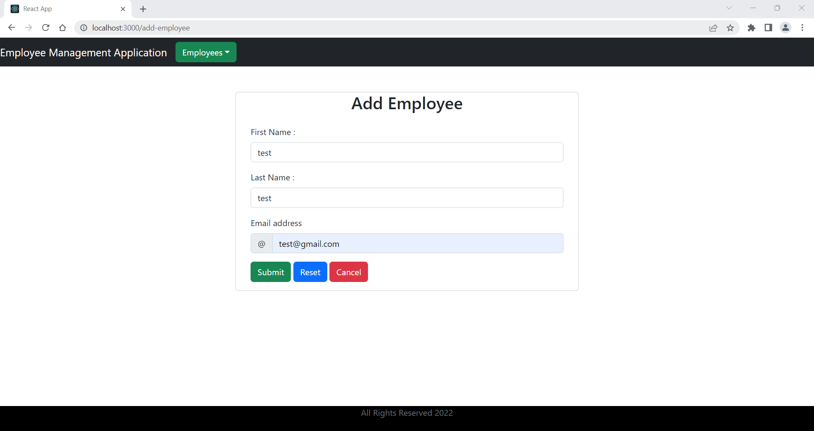
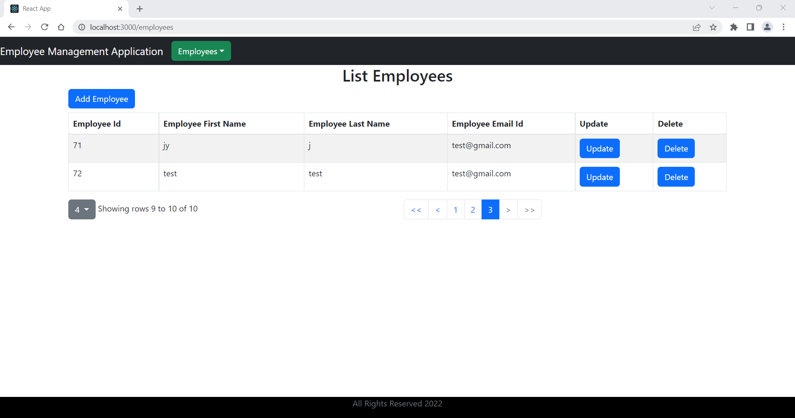
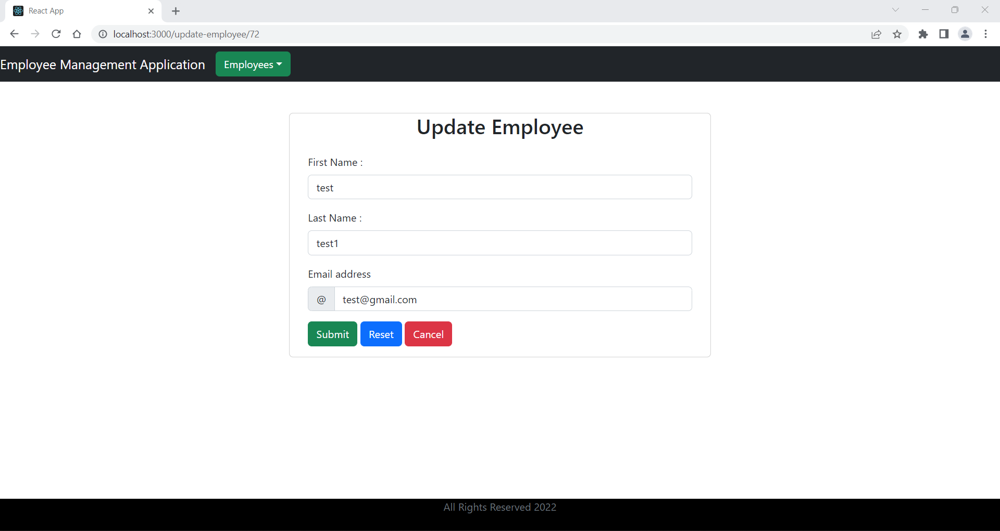
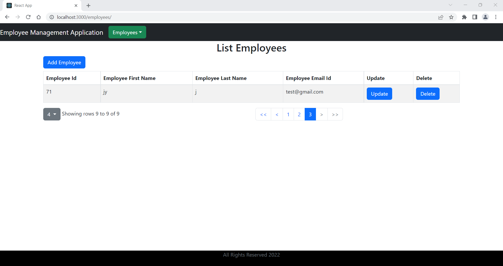

# React-Springboot-Pagination

## Basic Crud Operations with pagination from server side

- *Home Page*

- *List Employees*

- *Pagination*

- *Add Employee*

- *Add Employee After Submitting*

- *Update Employee*

- *Delete Employee*

